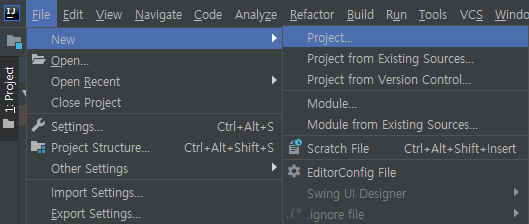
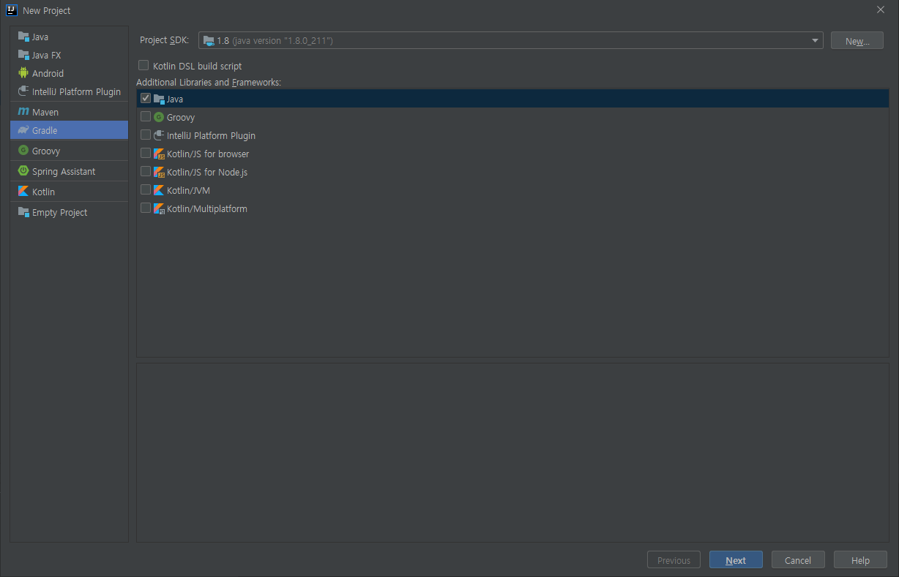
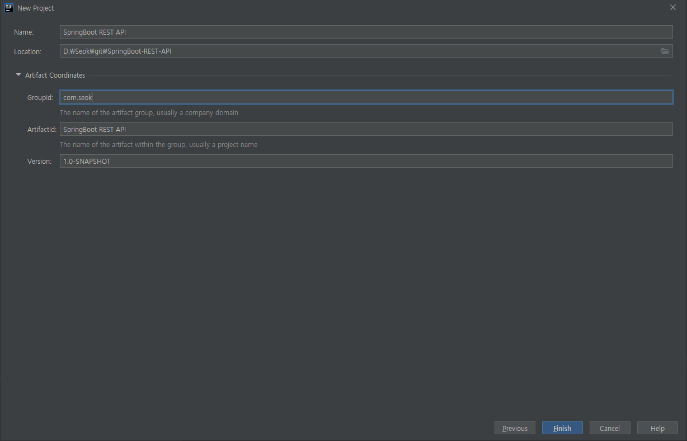
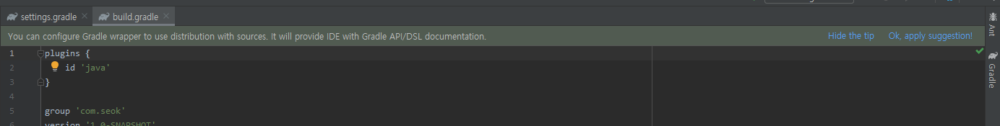
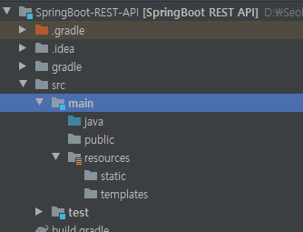
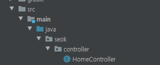
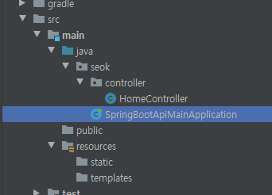
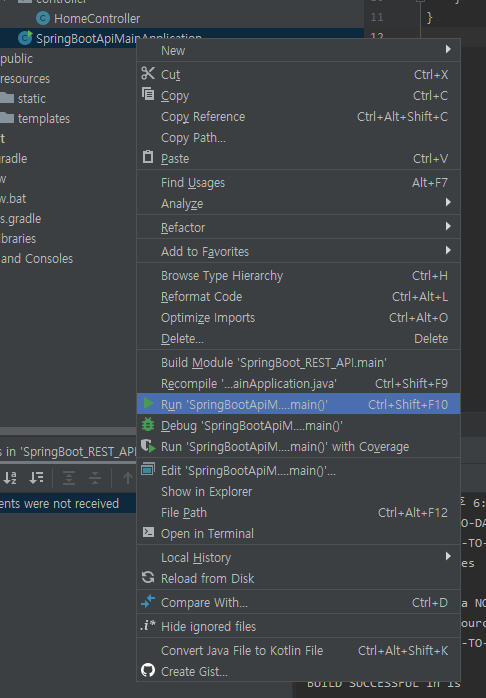
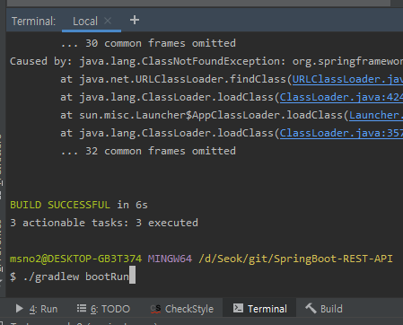
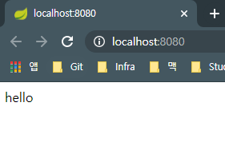

# Step01 Make Project

<br><br>

## Branch Name
step01-make-project

<br><br>

## 1. IntelliJ로 Spring Boot 프로젝트 만들기


<div style="text-align: center">
        
</div>

> file → New → Project 를 클릭해서 새로운 프로젝트를 생성

<br><br>

<div style="text-align: center">
        
</div>

> New Project의 유형 중에서 Gradle을 선택하고 Next 버튼을 클릭


<br><br>

<div style="text-align: center">
        
</div>

> 프로젝트 이름과 프로젝트가 저장될 로컬 디렉터리, 패키지명 지정

<br><br>

<div style="text-align: center">
        
</div>

> `Ok, apply suggestion!` 을 클릭

<br><br>
<br><br>


## 2. Spring Boot에 대한 이해

자바 기반에서 개발을 진행할 때 결과 파일 포맷은 크게 두 가지로 구분하며 로컬에서 실행되는 JAR, 웹 애플리케이션 컨테이너에서 실행되는 WAR입니다.

<br><br>

### Spring Boot에서 웹 자원들을 실행하기 위한 규약

<br><br>

<div style="text-align: center">
        
</div>

> 위와 같이 폴더를 생성

웹 자원들을 각 규약에 맞는 곳에 두면  웹을 위한 별도의 폴더를 만들지 않고 사용이 가능합니다.

<br><br>

### Gradle을 이용한 Spring Boot 설정

build.gradle 파일에서 Spring Boot 플러그인을 사용 할 수 있도록 설정하는데, 여기서 의존성을 추가하도록 합니다.

build.gradle 파일의 전체 내용은 다음과 같습니다.

```yaml
plugins {
    id 'java'
    id 'org.springframework.boot' version '1.5.8.RELEASE'
}

ext{
    springBootVersion='1.5.8.RELEASE'
}

sourceCompatibility = 1.8
targetCompatibility = 1.8

sourceSets{
    main{
        java {
            srcDir 'src/main/java'
        }
        resources{
            srcDir 'src/resources'
        }
    }
}

repositories {
    jcenter()
}

dependencies {
    compile 'org.springframework.boot:spring-boot-starter-web'
    compile "org.springframework.boot:spring-boot-starter-thymeleaf"
    compile "org.springframework.boot:spring-boot-devtools"

    compile group: 'org.webjars', name: 'webjars-locator', version: '0.32'

    compile 'org.webjars:jquery:3.1.0'
    compile 'org.webjars:bootstrap:3.3.1'
    compile 'org.webjars:materializecss:0.96.0'

    compile 'org.slf4j:slf4j-api:1.7.7'

    testCompile 'junit:junit:4.12'

    //capcha
    compile group: 'com.google.code.maven-play-plugin.org.playframework', name: 'jj-imaging', version: '1.1'
    compile group: 'com.google.code.maven-play-plugin.org.playframework', name: 'jj-simplecaptcha', version: '1.1'
}
```

<br><br>

### Controller 만들기

<div style="text-align: center">
        
</div>

> src/main/java/seok/controller 경로를 만들고, 그 밑에 HomeController.java 를 생성

<br><br>

HomeController.java의 전체는 다음과 같습니다.

```java
package seok.controller;

import org.springframework.web.bind.annotation.RequestMapping;
import org.springframework.web.bind.annotation.RestController;

@RestController
public class HomeController {
    @RequestMapping("/")
    public String hello() {
        return "hello";
    }
}
```

배포 시에 root-context를 `/` 로 설정할 것이므로 [http://localhost:8080을](http://localhost:8080을) 입력 했을 때 hello 가 출력되도록 합니다.

<br><br>

### Controller를 사용하는 Main 클래스 만들기

<div style="text-align: center">
        
</div>

> src/main/java/seok 경로 아래에 Main 클래스를 생성

<br><br>

[SpringBootApiMainApplication.java](http://springbootapimainapplication.java) 의 전체 내용은 다음과 같습니다.

```java
package seok;

import org.springframework.boot.SpringApplication;
import org.springframework.boot.autoconfigure.SpringBootApplication;

@SpringBootApplication
public class SpringBootApiMainApplication {
    public static void main(String[] args) {
        SpringApplication.run(SpringBootApiMainApplication.class, args);
    }
}
```
<br>

@SpringBootApplication 어노테이션의 역할

- @ComponentScan(basePadkages = "seok.controller")
- @Configuration
- @EnableAutoConfiguration

의 세 가지 어노테이션을 @SpringBootApplication 어노테이션으로 대체 할 수 있습니다.

<br><br>

### 실행하는 방법 2가지

<div style="text-align: center">
        
</div>

> [SpringBootApiMainApplication.java](http://springbootapimainapplication.java) 를 우클릭 하고 `Run`

<br>

<div style="text-align: center">
        
</div>

> Terminal 탭을 열어 `./gradlew bootRun` 명령어 실행

(참고로 해당 terminal은 git bash로 실행 중)

<br><br>

실행하게 되면 다음과 같은 로그를 볼 수 있습니다.

```text
오후 7:01:11: Executing task 'SpringBootApiMainApplication.main()'...

> Task :compileJava UP-TO-DATE
> Task :processResources NO-SOURCE
> Task :classes UP-TO-DATE

> Task :SpringBootApiMainApplication.main()

...

  .   ____          _            __ _ _
 /\\ / ___'_ __ _ _(_)_ __  __ _ \ \ \ \
( ( )\___ | '_ | '_| | '_ \/ _` | \ \ \ \
 \\/  ___)| |_)| | | | | || (_| |  ) ) ) )
  '  |____| .__|_| |_|_| |_\__, | / / / /
 =========|_|==============|___/=/_/_/_/
 :: Spring Boot ::        (v1.5.8.RELEASE)

...

2020-06-06 19:01:17.135  INFO 18752 --- [  restartedMain] o.s.j.e.a.AnnotationMBeanExporter        : Registering beans for JMX exposure on startup
2020-06-06 19:01:17.203  INFO 18752 --- [  restartedMain] s.b.c.e.t.TomcatEmbeddedServletContainer : Tomcat started on port(s): 8080 (http)
2020-06-06 19:01:17.208  INFO 18752 --- [  restartedMain] seok.SpringBootApiMainApplication        : Started SpringBootApiMainApplication in 3.963 seconds (JVM running for 4.709)
```

이제 브라우저를 열어 [localhost:8080](http://localhost:8080) 을 입력해봅니다.

<div style="text-align: center">
        
</div>