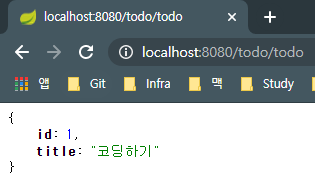
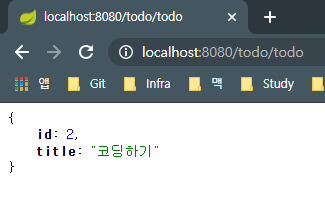
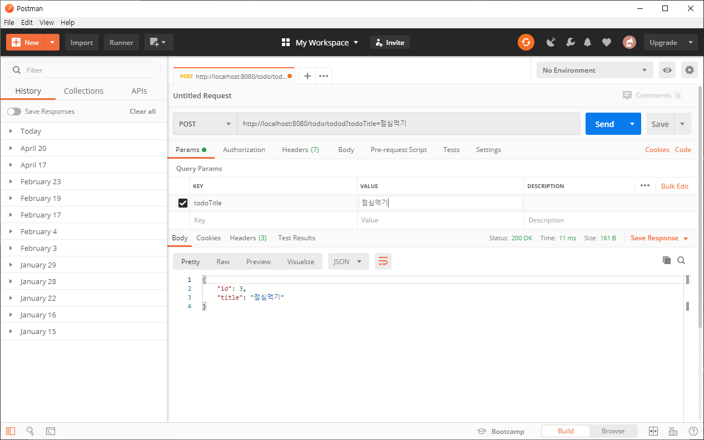
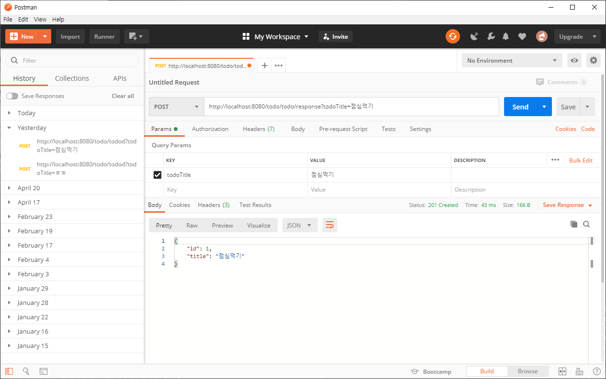
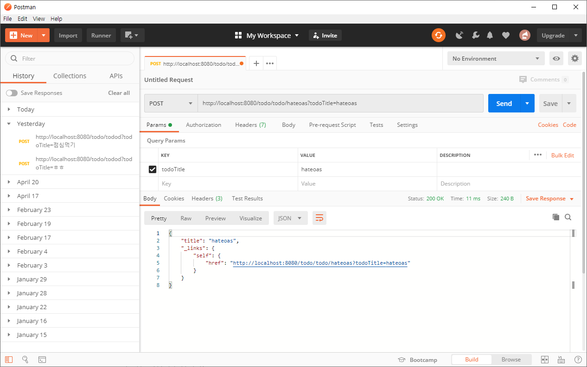
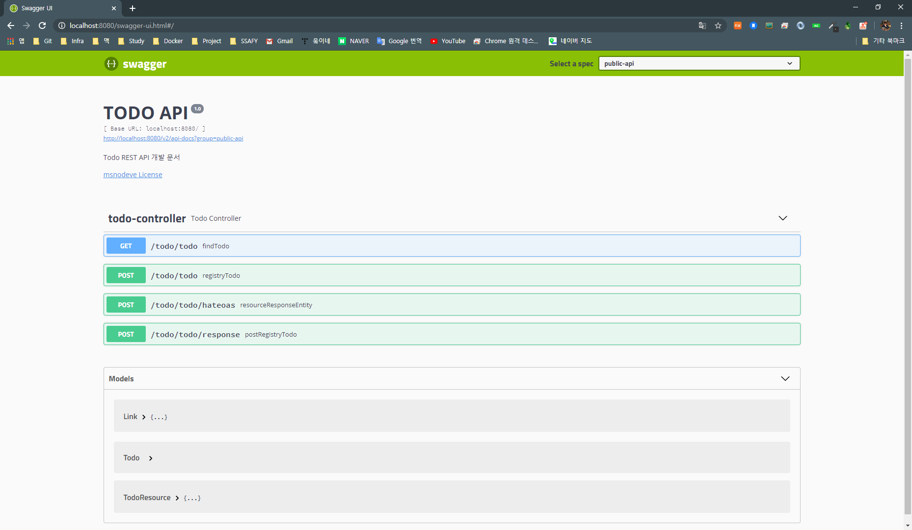

# Step02 Make REST API

<br><br>

## Branch Name
step02-make-rest-api

<br><br>

## REST의 특성
- `클라이언트/서버` 클라이언트와 서버가 서로 독립적으로 구분 되어야 한다. 또한 서버 또는 클라이언트 증설 시 서로간의 의존성 때문에 확장에 문제가 되서는 안된다.
- `상태 없음` 서버는 클라이언트의 상태를 기억할 필요가 없다.
- `레이어드 아키텍처` 다계층 형태로 레이어를 추가하거나 수정, 제거 할 수 있고 확장성이 있어야한다.
- `캐시` 클라이언트가 캐시를 통해서 응답을 재사용 하여 이를 통해 서버의 부하를 낮춰 서버의 성능이 향상 될 수 있다.
- `코드 온 디멘드` 요청이 오면 코드를 준다.

<br>

## REST 인터페이스 규칙
- `리소스 식별` 웹 안에서 URI와 같은 고유 식별자를 통해 표현한다.
- `표현을 통한 리소스 처리` JSON, XML, HTML 페이지와 같이 다양한 유형으로 표현 할 수 있다.
- `자기 묘사 메세지` HTTP 통신 할 때 Http header에 메타 데이터 정보를 추가해서 실제 데이터와는 관련 없지만 데이터에 대한 설명을 나타내는 정보를 담을 수 있다.
- `애플리케이션 상태 하이퍼미디어(HATEOAS)` REST API를 개발할 때도 단순히 데이터만 전달하는 것이 아닌 링크 정보까지 포함한다.

<br><br>

## REST API 만들기

### 모델 클래스 만들기

데이터를 담을 수 있는 클래스를 만듭니다.

> src/main/java/seok/model 경로를 만들고, 그 밑에 Todo.java 를 생성

<br>

<br>


Todo.java 내용은 다음과 같습니다.

```java
package seok.model;

public class Todo {
    private int id;
    private String title;

    public Todo(int id, String title) {
        this.id = id;
        this.title = title;
    }

    public int getId() {
        return id;
    }

    public void setId(int id) {
        this.id = id;
    }

    public String getTitle() {
        return title;
    }

    public void setTitle(String title) {
        this.title = title;
    }
}
```


<br><br>


### 컨트롤러 클래스 만들기

URL을 요청하면 Todo 클래스의 인스턴스를 생성해 JSON으로 보여줄 수 있는 컨트롤러를 만듭니다.


> src/main/java/seok/controller 경로 밑에 TodoController.java 를 생성

TodoController.java 내용은 다음과 같습니다.

```java
package seok.controller;

import org.springframework.web.bind.annotation.RequestMapping;
import org.springframework.web.bind.annotation.RestController;
import seok.model.Todo;

import java.util.concurrent.atomic.AtomicInteger;

@RestController
@RequestMapping(value = "/todo")
public class TodoController {
    private final AtomicInteger counter = new AtomicInteger();

    @RequestMapping("/todo")
    public Todo todo(){
        return new Todo(counter.incrementAndGet(), "코딩하기");
    }
}
```


`AtomicInteger`는 Atomic(더 이상 쪼개질 수 없는 성질)을 의미하며, 단순히 Integer 타입으로 선언한다면 서로 다른 Thread 에서 하나의 변수에 대해 값을 쓰거나 읽기 때문에 문제가 발생할 수 있지만, `AtomicInteger`를 쓰므로 `Thread-safe` 하게 처리가 가능합니다.


<br><br>


### 실행해보기

localhost:8080/todo/todo 를 계속 호출해보면 호출 할 때마다 숫자가 정상적으로 증가하는 것을 확인 할 수 있습니다.


<div style="text-align: center">
    
</div>


<div style="text-align: center">
        
</div>


## REST API에서 HTTP Method 사용

### 컨트롤러 메서드에 POST 매핑

TodoController.java 에 POST 메서드를 만듭니다.

```java
@PostMapping("/todo")
public Todo registryTodo(@RequestParam(value="todoTitle") String todoTitle){
    return new Todo(counter.incrementAndGet(), todoTitle);
}
```


`/todo/todo`를 엔드 포인트로 합니다.

GET은 Body 가 없어서 URL을 직접 호출 할 수 있지만, POST는 요청의 몸체가 되므로 도구를 사용해서 테스트 해봐야합니다.

여기서는 `Postman`를 사용하도록 하겠습니다.

[Postman 설치하기](https://www.postman.com/downloads/)

<div style="text-align: center">
        
</div>

위와 같이 실행하면 결과값을 받아 볼 수 있습니다.


<br><br>


### 응답 헤더 활용하기

ResponseEntity 클래스는 HttpEntity를 상속받은 클래스로 Http 응답에 대한 상태값을 표현 할 수 있습니다.

TodoController.java 에 다음 코드를 추가합니다.


```java
@PostMapping("/todo/response")
public ResponseEntity<Todo> postRegistryTodo(@RequestParam String todoTitle){
    return new ResponseEntity<>(new Todo(counter.incrementAndGet(), todoTitle), HttpStatus.CREATED);
}
```

<div style="text-align: center">
        
</div>

결과를 받아보면 `Status: 201 Created` 라는 결과를 받아 볼 수 있습니다.


<br><br>


## HATEOAS를 사용한 URI 정보 표현하기

### HATEOAS 설정

build.gradle 파일에 다음 라이브러리를 추가합니다.

```yaml
dependencies {
	compile 'org.springframework.boot:spring-boot-starter-hateoas'
}
```

<br>

<br>


`ResourceSupport` 클래스를 상속받을 모델 클래스 `TodoResource.java`를 만들도록 하겠습니다.

```java
package seok.model;

import org.springframework.hateoas.ResourceSupport;

public class TodoResource extends ResourceSupport {
    private String title;

    public TodoResource() {

    }

    public TodoResource(String title) {
        this.title = title;
    }

    public String getTitle() {
        return title;
    }

    public void setTitle(String title) {
        this.title = title;
    }
}
```


<br><br>


`Controller`에 다음을 추가하도록 하겠습니다.

```java
import static org.springframework.hateoas.mvc.ControllerLinkBuilder.linkTo;
import static org.springframework.hateoas.mvc.ControllerLinkBuilder.methodOn;

...

@PostMapping("/todo/hateoas")
public ResponseEntity<TodoResource> resourceResponseEntity(@RequestParam String todoTitle){
    TodoResource todoResource = new TodoResource(todoTitle);
    todoResource.add(linkTo(methodOn(TodoController.class).resourceResponseEntity(todoTitle)).withSelfRel());
    return new ResponseEntity<>(todoResource, HttpStatus.OK);
}
```

> todoResource 인스턴스를 생성한 후에 링크 정보 추가를 위해서 linkTo 메서드로 TodoController 클래스의 resourceResponseEntity 메서드를 매핑후, withSelfRel 메서드를 이용해 URL 정보를 만들고 add메서드로 정보를 추가했습니다.


결과는 다음과 같습니다.

<div style="text-align: center">
        
</div>


## REST API 문서화

> API를 제공하려면 가이드 문서 제공이 필수적인데, 개발할 때 마다 별도의 문서를 작성하고 업데이트하는 것은 비용이 많이 듭니다. 따라서 `Swagger` 를 이용해서 API를 설명하는 페이지를 자동 생성하는 방법을 알아 보도록 하겠습니다.


### Swagger 라이브러리 추가

build.gradle에 `springfox-swagger2`, `springfox-swagger-ui`을 추가합니다.

> `dependencies`의 라이브러리들을 최신, 가장많이 사용하는 라이브러리들로 좀 교체했습니다.
> build.gradle의 전체 내용은 다음과 같습니다.

```yaml
plugins {
    id 'java'
    id 'org.springframework.boot' version '2.2.2.RELEASE'
}

ext{
    springBootVersion='2.2.2.RELEASE'
}

sourceCompatibility = 1.8
targetCompatibility = 1.8


sourceSets{
    main{
        java {
            srcDir 'src/main/java'
        }
        resources{
            srcDir 'src/resources'
        }
    }
}


repositories {
    jcenter()
}

dependencies {
    compile group: 'org.springframework.boot', name: 'spring-boot-starter-web', version: '2.2.2.RELEASE'
    compile group: 'org.springframework.boot', name: 'spring-boot-devtools', version: '2.0.4.RELEASE'
    compile group: 'org.springframework.boot', name: 'spring-boot-starter-hateoas', version: '2.1.5.RELEASE'
    compile group: 'io.springfox', name: 'springfox-swagger2', version: '2.9.2'
    compile group: 'io.springfox', name: 'springfox-swagger-ui', version: '2.9.2'

    compile 'org.slf4j:slf4j-api:1.7.7'

    testCompile 'junit:junit:4.12'

    //capcha
    compile group: 'com.google.code.maven-play-plugin.org.playframework', name: 'jj-imaging', version: '1.1'
    compile group: 'com.google.code.maven-play-plugin.org.playframework', name: 'jj-simplecaptcha', version: '1.1'
}
```


### SwaggerConfiguration 클래스 만들기

> src/main/java/seok/configuration 패키지 생성 후 SwaggerConfiguration.java 클래스를 생성합니다.

```java
package seok.configuration;

import com.google.common.base.Predicate;
import org.springframework.context.annotation.Bean;
import org.springframework.context.annotation.Configuration;
import springfox.documentation.builders.ApiInfoBuilder;
import springfox.documentation.service.ApiInfo;
import springfox.documentation.spi.DocumentationType;
import springfox.documentation.spring.web.plugins.Docket;
import springfox.documentation.swagger2.annotations.EnableSwagger2;

import static com.google.common.base.Predicates.or;
import static springfox.documentation.builders.PathSelectors.regex;

@Configuration
@EnableSwagger2
public class SwaggerConfiguration {
    @Bean
    public Docket postsApi() {
        return new Docket(DocumentationType.SWAGGER_2).groupName("public-api")
                .apiInfo(apiInfo()).select().paths(postPaths()).build();
    }

    private Predicate<String> postPaths() {
        return or(regex("/todo/.*"));
    }

    private ApiInfo apiInfo() {
        return new ApiInfoBuilder().title("TODO API")
                .description("Todo REST API 개발 문서")
                .license("msnodeve License")
                .licenseUrl("msnodeve@gmail.com").version("1.0").build();
    }
}
```

<br>

```java
private Predicate<String> postPaths() {
    return or(regex("/todo/.*"));
}
```

해당 부분은 컨트롤러의 기본 URI 가 todo로 시작하기 때문에 /todo만 인식하도록 설정을 추가한 것 입니다.


<br><br>


### 실행해보기

http://localhost:8080/swagger-ui.html#/ 로 접속을 해보면 지금까지 작성해온 API가 UI로 표시되는 모습을 확인 할 수 있습니다.

<div style="text-align: center">
        
</div>

각  메서드의 별도 동작은 한번씩 작동 시켜보길 바랍니다.

