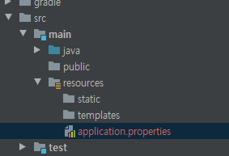
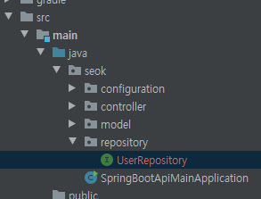
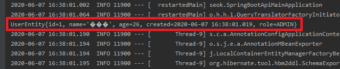
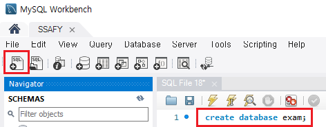
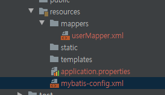
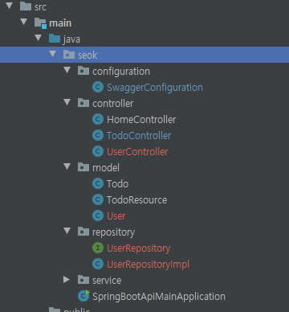
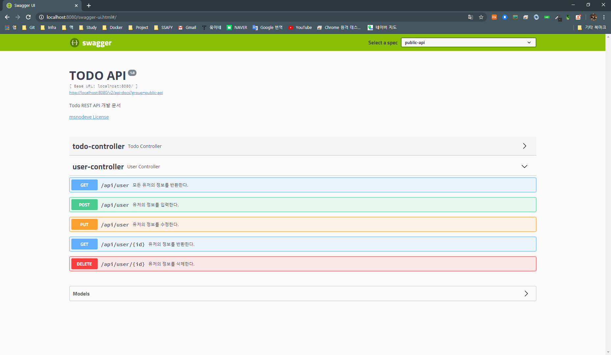
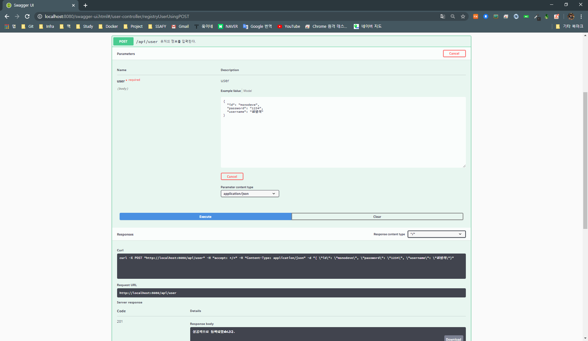
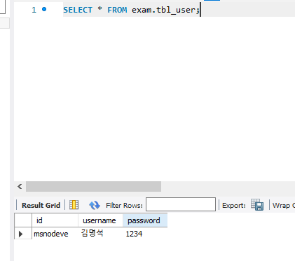

# Step03 SpringBoot, Database

<br><br>

## Branch Name
step03-springboot-data

<br><br>


## SpringBoot와 Database 연동을 해보자

> API를 사용자에게 지속적으로 제공하기 위해서는 영속적인 저장소가 필요합니다.
>
> 따라서 RDBMS(Relational Database Management System)에 속하는 제품을 사용합니다.


<br>
<br>


### 의존성 제외 설정

> src/main/resources 폴더 밑에 `application.properties` 파일을 생성합니다.

<div style="text-align: center">
        
</div>

`application.properties` 에 다음 줄을 추가합니다.

```yaml
spring.main.web-environment=false
```


<br><br>


build.gradle에 필요한 라이브러리를 추가합니다.

> 버전을 다시 고쳤습니다. 복붙해주세요.

```yaml
plugins {
    id 'java'
    id 'org.springframework.boot' version '1.5.8.RELEASE'
}

ext{
    springBootVersion='1.5.8.RELEASE'
}

sourceCompatibility = 1.8
targetCompatibility = 1.8


sourceSets{
    main{
        java {
            srcDir 'src/main/java'
        }
        resources{
            srcDir 'src/resources'
        }
    }
}


repositories {
    jcenter()
}

dependencies {
    compile 'org.springframework.boot:spring-boot-starter-web'
    compile "org.springframework.boot:spring-boot-devtools"

    compile 'org.slf4j:slf4j-api:1.7.7'

    testCompile 'junit:junit:4.12'

    compile group: 'org.springframework.boot', name: 'spring-boot-starter-hateoas', version: '2.1.5.RELEASE'

    compile group: 'io.springfox', name: 'springfox-swagger2', version: '2.9.2'
    compile group: 'io.springfox', name: 'springfox-swagger-ui', version: '2.9.2'

    compile group: 'org.hsqldb', name: 'hsqldb', version:'2.3.2'
    compile "org.springframework.boot:spring-boot-starter-data-jpa:${springBootVersion}"
    compile group: 'org.hibernate', name: 'hibernate-validator', version: '4.2.0.Final'
    compile group: 'javax.el', name: 'javax.el-api', version: '3.0.0'
    compile group: 'javax.validation', name: 'validation-api', version: '1.0.0.GA'

    //capcha
    compile group: 'com.google.code.maven-play-plugin.org.playframework', name: 'jj-imaging', version: '1.1'
    compile group: 'com.google.code.maven-play-plugin.org.playframework', name: 'jj-simplecaptcha', version: '1.1'
}
```

> 데이터 저장소로는 hsqldb를 사용하며, 이는 소형 관계형 데이터베이스 엔진의 일종으로 JDBC를 지원하고, 라이브러리 추가만으로 사용가능해서 로컬 개발시에 많이 쓰입니다.


<br>

<br>


## Database Object Mapping

#### 값 매핑

>  src/main/java/seok/model 패키지 밑에 일반 사용자와 관리자 구분을 하는 UserRole.java Enum 클래스를 하나 생성합니다.

```java
package seok.model;

public enum UserRole {
    USER, // 0
    ADMIN // 1
}
```

<br><br>


#### UserEntity 클래스를 만들어 보자

> src/main/java/seok/model 패키지 밑에 UserEntity.java 클래스를 생성합니다.

```java
package seok.model;

import javax.persistence.*;
import java.util.Date;

@Entity
public class UserEntity {
    @Id
    @GeneratedValue(strategy = GenerationType.AUTO)
    private Long id;
    private String name;
    private Integer age;
    private Date created;

    @Column(name="role")
    @Enumerated(EnumType.ORDINAL)
    private UserRole role;

    @PrePersist
    public void beforeCreate(){
        created = new Date();
    }

    public UserEntity() {
    }

    public UserEntity(String name, Integer age, UserRole role) {
        this.name = name;
        this.age = age;
        this.role = role;
    }

    public Long getId() {
        return id;
    }

    public void setId(Long id) {
        this.id = id;
    }

    public String getName() {
        return name;
    }

    public void setName(String name) {
        this.name = name;
    }

    public Integer getAge() {
        return age;
    }

    public void setAge(Integer age) {
        this.age = age;
    }

    public Date getCreated() {
        return created;
    }

    public void setCreated(Date created) {
        this.created = created;
    }

    @Override
    public String toString() {
        return "UserEntity{" +
                "id=" + id +
                ", name='" + name + '\'' +
                ", age=" + age +
                ", created=" + created +
                ", role=" + role +
                '}';
    }
}
```

`@Entity(데이터베이스 스키마의 내용을 자바 클래스로 표현할 수 있는 대상)` 어노테이션을 선언함으로써 엔티티 매니저가 관리해야 할 대상임을 명시합니다.

`@Enumerated` 어노테이션 속성으로 `@EnumType`을 지정할 때, `ORDINAL`로 하면 값이 `int`로 할당 되며 `STRING`으로 지정하면 `ENUM의 이름`으로 할당 됩니다.

<br>

<br>


### User Repository 인터페이스를 생성하자

> src/main/java/seok 패키지 밑에 repository 패키지를 생성 후, UserRepository.java 인터페이스를 생성합니다.

<div style="text-align: center">
    
</div>

```java
package seok.repository;

import org.springframework.data.jpa.repository.JpaRepository;
import org.springframework.data.repository.query.Param;
import org.springframework.stereotype.Repository;
import seok.model.UserEntity;

@Repository
public interface UserRepository extends JpaRepository<UserEntity, Long> {
    UserEntity findByName(@Param("name") String name);
}
```

> 필드를 검색하기 위해 다음과 같이 사용할 수 있습니다.

```java
반환 타입 findBy 필드명(파라미터);
```

<br><br>


### 실행 결과 보기

<div style="text-align: center">
        
</div>

> `application.properties` 에 spring.main.web-environment=false 를 설정해줬기 때문에 웹은 실행되지않고, 종료합니다. 


<br>

<br>

<br>


## Database Server와 연동

### MySQL 설치

[MySQL DB 설치하기](https://dev.mysql.com/downloads/mysql/) 각 환경에 맞는 서버를 설치합니다.

[MySQL WorkBench](https://dev.mysql.com/downloads/workbench/) 도 설치하면 좋을 것 같습니다.


<br>

<br>

### Database, Table 생성하기

<div style="text-align: center">
        
</div>

```mysql
create database exam;
```

`exam` 이라는 데이터베이스를 하나 생성합니다.


<br>

```mysql
create table tbl_user(
	id varchar(40) not null,
    username varchar(45) not null,
    password varchar(45) not null
);
```

`user` 정보 테이블을 생성합니다.


 <br>

 <br>


### Database Connection Pool `HikariCP` 사용하기

build.gradle 라이브러리 추가합니다.

```yaml
plugins {
    id 'java'
    id 'idea'
    id 'org.springframework.boot' version '1.5.8.RELEASE'
}

ext{
    springBootVersion='1.5.8.RELEASE'
}

sourceCompatibility = 1.8
targetCompatibility = 1.8


sourceSets{
    main{
        java {
            srcDir 'src/main/java'
        }
        resources{
            srcDir 'src/resources'
        }
    }
}


repositories {
    jcenter()
}

dependencies {
    compile 'org.springframework.boot:spring-boot-starter-web'
    compile "org.springframework.boot:spring-boot-devtools"

    compile 'org.slf4j:slf4j-api:1.7.7'

    testCompile 'junit:junit:4.12'

    compile group: 'org.springframework.boot', name: 'spring-boot-starter-hateoas', version: '2.1.5.RELEASE'

    compile group: 'io.springfox', name: 'springfox-swagger2', version: '2.9.2'
    compile group: 'io.springfox', name: 'springfox-swagger-ui', version: '2.9.2'

    compile group: 'org.springframework.boot', name: 'spring-boot-starter-jdbc', version: '2.3.0.RELEASE'
    compile group: 'com.zaxxer', name: 'HikariCP', version: '2.5.1'
    compile group: 'org.mybatis.spring.boot', name: 'mybatis-spring-boot-starter', version: '1.3.0'
    compile group: 'mysql', name: 'mysql-connector-java', version: '8.0.13'


    //capcha
    compile group: 'com.google.code.maven-play-plugin.org.playframework', name: 'jj-imaging', version: '1.1'
    compile group: 'com.google.code.maven-play-plugin.org.playframework', name: 'jj-simplecaptcha', version: '1.1'
}
```


`application.properties` 에 MySQL DB 서버 정보를 설정합니다.

```yaml
spring.datasource.driverClassName=com.mysql.cj.jdbc.Driver
spring.datasource.url=jdbc:mysql://127.0.0.1:3306/exam?serverTimezone=UTC&useUniCode=yes&characterEncoding=UTF-8
spring.datasource.username=ssafy
spring.datasource.password=ssafy

mybatis.config-location=classpath:mybatis-config.xml
```

<br>

<br>


### Mybitis와 MySQL 연동

> src/main/resources 아래 다음 파일을 생성합니다.

<div style="text-align: center">
        
</div>

```xml
<!-- mybatis-config.xml -->
<?xml version="1.0" encoding="UTF-8" ?>
<!DOCTYPE configuration PUBLIC "-//mybatis.org//DTD Config 3.0//EN"
	"http://mybatis.org/dtd/mybatis-3-config.dtd">
<configuration>
	<mappers>
		<mapper resource="mappers/userMapper.xml" />
	</mappers>
</configuration>
```

<br>

```xml
<!-- userMapper.xml -->
<?xml version="1.0" encoding="UTF-8"?>

<!DOCTYPE mapper
    PUBLIC "-//mybatis.org//DTD Mapper 3.0//EN"
    "http://mybatis.org/dtd/mybatis-3-mapper.dtd">
<mapper namespace="user">
    <insert id="insertUser">
        insert into tbl_user(id, username, password)
        value (#{id}, #{username}, #{password})
    </insert>

    <select id="selectAll" resultType="seok.model.User">
        select id, username, password
        from tbl_user
    </select>

    <select id="select" resultType="seok.model.User">
        select id, username, password
        from tbl_user
        where id = #{id}
    </select>

    <update id="update">
        update tbl_user
        set username = #{username}, password = #{password}
        where id = #{id}
    </update>

    <delete id="delete">
        delete from tbl_user
        where id = #{id}
    </delete>
</mapper>
```


<br>

<br>


### MVC 패턴으로 패키지 구성하기

<div style="text-align: center">
        
</div>

위 그림과 같이 파일을 구성 합니다.

```java
package seok.repository;

import seok.model.User;

import java.util.List;

public interface UserRepository {
    public List<User> selectAll() throws Exception;

    public User select(String id) throws Exception;

    public int insert(User user) throws Exception;

    public int update(User user) throws Exception;

    public int delete(String id) throws Exception;
}
```

<br>

```java
package seok.repository;

import org.apache.ibatis.session.SqlSession;
import org.springframework.beans.factory.annotation.Autowired;
import org.springframework.stereotype.Repository;
import seok.model.User;

import java.util.List;

@Repository
public class UserRepositoryImpl implements UserRepository {
    private static final String MAPPER_NAME_SPACE = "user.";

    @Autowired
    SqlSession sqlSession;

    @Override
    public List<User> selectAll() throws Exception {
        return sqlSession.selectList(MAPPER_NAME_SPACE + "selectAll");
    }

    @Override
    public User select(String id) throws Exception {
        return sqlSession.selectOne(MAPPER_NAME_SPACE + "select", id);
    }

    @Override
    public int insert(User user) throws Exception {
        return sqlSession.insert(MAPPER_NAME_SPACE + "insertUser", user);
    }

    @Override
    public int update(User user) throws Exception {
        return sqlSession.update(MAPPER_NAME_SPACE + "update", user);
    }

    @Override
    public int delete(String id) throws Exception {
        return sqlSession.delete(MAPPER_NAME_SPACE + "delete", id);
    }
}
```

<br>

```java
package seok.service;

import seok.model.User;

import java.util.List;

public interface UserService {
    public List<User> findAllUsers() throws Exception;

    public User findByUserId(String id) throws Exception;

    public int registry(User user) throws Exception;

    public int modify(User user) throws Exception;

    public int remove(String id) throws Exception;
}
```

<br>

```java
package seok.service;

import org.springframework.beans.factory.annotation.Autowired;
import org.springframework.stereotype.Service;
import seok.model.User;
import seok.repository.UserRepository;

import java.util.List;

@Service
public class UserServiceImpl implements UserService{
    @Autowired
    UserRepository repository;

    @Override
    public List<User> findAllUsers() throws Exception {
        return repository.selectAll();
    }

    @Override
    public User findByUserId(String id) throws Exception {
        return repository.select(id);
    }

    @Override
    public int registry(User user) throws Exception {
        return repository.insert(user);
    }

    @Override
    public int modify(User user) throws Exception {
        return repository.update(user);
    }

    @Override
    public int remove(String id) throws Exception {
        return repository.delete(id);
    }
}
```

<br>

```java
package seok.controller;

import io.swagger.annotations.Api;
import io.swagger.annotations.ApiOperation;
import org.springframework.beans.factory.annotation.Autowired;
import org.springframework.http.HttpStatus;
import org.springframework.http.ResponseEntity;
import org.springframework.web.bind.annotation.*;
import seok.model.User;
import seok.service.UserService;

import java.util.List;

@RestController
@RequestMapping(value = "/api")
@Api(value="msnodeve")
public class UserController {

    @Autowired
    UserService service;

    @GetMapping("/user")
    @ApiOperation(value = "모든 유저의 정보를 반환한다.", response = List.class)
    public ResponseEntity<List<User>> findAllUsers() {
        List<User> users = null;
        try {
            users = service.findAllUsers();
        } catch (Exception e) {
            e.printStackTrace();
            return new ResponseEntity<>(null, HttpStatus.NO_CONTENT);
        }
        return new ResponseEntity<>(users, HttpStatus.OK);
    }

    @GetMapping("/user/{id}")
    @ApiOperation(value = "유저의 정보를 반환한다.", response = Object.class)
    public ResponseEntity<User> findByUserId(@PathVariable String id) {
        User user = null;
        try {
            user = service.findByUserId(id);
        } catch (Exception e) {
            e.printStackTrace();
            return new ResponseEntity<>(null, HttpStatus.NO_CONTENT);
        }
        return new ResponseEntity<>(user, HttpStatus.OK);
    }

    @PostMapping("/user")
    @ApiOperation(value = "유저의 정보를 입력한다.", response = String.class)
    public ResponseEntity<String> registryUser(@RequestBody User user) {
        try {
            if (service.registry(user) != 0)
                return new ResponseEntity<>("성공적으로 등록되었습니다.", HttpStatus.CREATED);
            else
                return new ResponseEntity<>("등록 실패했습니다.", HttpStatus.BAD_REQUEST);
        } catch (Exception e) {
            e.printStackTrace();
        }
        return new ResponseEntity<>("등록 실패했습니다.", HttpStatus.BAD_REQUEST);
    }

    @PutMapping("/user")
    @ApiOperation(value = "유저의 정보를 수정한다.", response = String.class)
    public ResponseEntity<String> modifyUser(@RequestBody User user) {
        try {
            if (service.modify(user) != 0)
                return new ResponseEntity<>("성공적으로 수정되었습니다.", HttpStatus.OK);
            else
                return new ResponseEntity<>("수정 실패했습니다.", HttpStatus.BAD_REQUEST);
        } catch (Exception e) {
            e.printStackTrace();
        }
        return new ResponseEntity<>("수정 실패했습니다.", HttpStatus.BAD_REQUEST);
    }

    @DeleteMapping("/user/{id}")
    @ApiOperation(value = "유저의 정보를 삭제한다.", response = String.class)
    public ResponseEntity<String> removeUser(@PathVariable String id) {
        try {
            if (service.remove(id) != 0)
                return new ResponseEntity<>("성공적으로 삭제되었습니다.", HttpStatus.OK);
            else
                return new ResponseEntity<>("삭제 실패했습니다.", HttpStatus.BAD_REQUEST);
        } catch (Exception e) {
            e.printStackTrace();
        }
        return new ResponseEntity<>("삭제 실패했습니다.", HttpStatus.BAD_REQUEST);
    }
}
```


<br>

<br>


### 실행해보기

<div style="text-align: center">
        
</div>

#### 등록하기

<div style="text-align: center">
        
</div>

#### DB 결과

<div style="text-align: center">
        
</div>